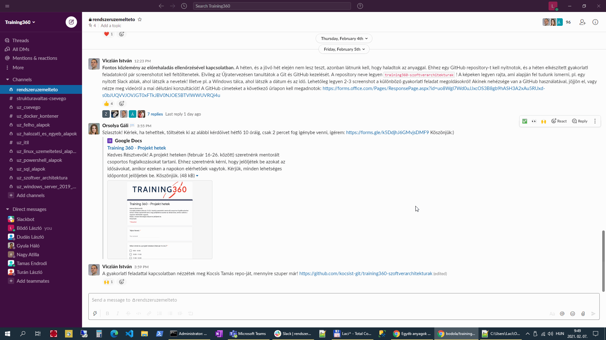

# training360-szoftverarchitekturak
# Standalone konzolos alkalmazás (gyakorlat)
# Standalone alkalmazás grafikus felülettel (gyakorlat)
# Központi adatbázis (gyakorlat)
# SQL nyelv (gyakorlat)
# NOSQL adatbázisok (gyakorlat)
# Többrétegű alkalmazások (gyakorlat)
# Webes alkalmazás (gyakorlat)
# Web formátumai: HTML és CSS (gyakorlat)
# Webes alkalmazas RIA felülettel - JavaScript (gyakorlat)
# Webes alkalmazas RIA felülettel - webes alkalmazas (gyakorlat)
# REST webszolgáltatások - Swagger (gyakorlat)
# REST webszolgáltatások - Postman (gyakorlat)
# Szerver alkalmazas webszolgáltatás interfesszel (gyakorlat)
# Magas rendelkezésre állás és skálázhatóság (gyakorlat)
# Virtualizació (gyakorlat)

