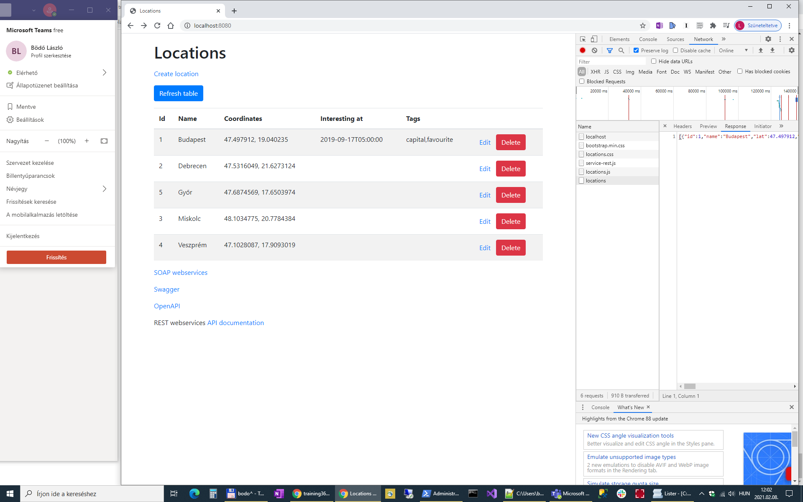

# training360-szoftverarchitekturak
## Standalone konzolos alkalmazás (gyakorlat) 

## Standalone alkalmazás grafikus felülettel (gyakorlat)

## Központi adatbázis (gyakorlat)

## SQL nyelv (gyakorlat)

## NOSQL adatbázisok (gyakorlat)

## Többrétegű alkalmazások (gyakorlat)

## Webes alkalmazás (gyakorlat)

## Web formátumai: HTML és CSS (gyakorlat)

## Webes alkalmazás RIA felülettel - JavaScript (gyakorlat)

## Webes alkalmazás RIA felülettel - webes alkalmazas (gyakorlat)

## REST webszolgáltatások - Swagger (gyakorlat)

## REST webszolgáltatások - Postman (gyakorlat)

## Szerver alkalmazás webszolgáltatás interfésszel (gyakorlat)

## Magas rendelkezésre állás és skálázhatóság (gyakorlat)

## Virtualizació (gyakorlat)

